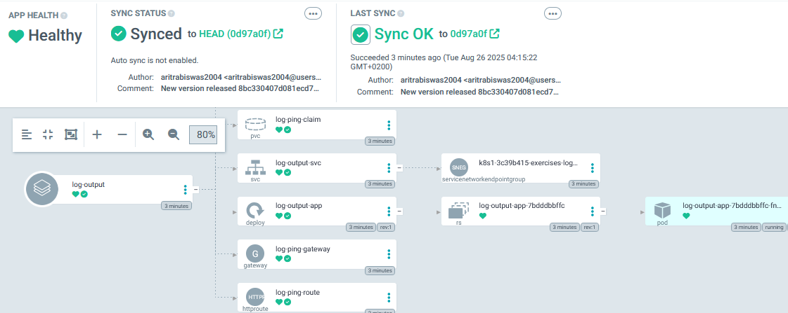

# Log Output Application

This application is split into `log-reader` and `log-writer`.

## Deployment

### Using Kustomize and GitOps

Is done upon push to the repo and the `kustomization.yaml` in the root of the log-output application.

### Deployment other way

The following can be created with `kubectl apply -f manifests/`

- ConfigMap
- Deployment
- Service
- Ingress (if applicable)
- Gateway
- HTTPRoute

## Screenshots for exercise `4.7`

### Lens Screenshot

Log-output running fine along with the dependent ping-pong application

### ArgoCD Screenshot

Entire pipeline on ArgoCD

