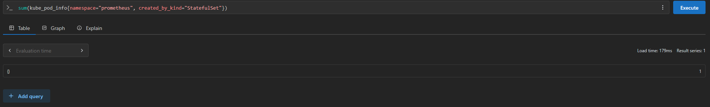
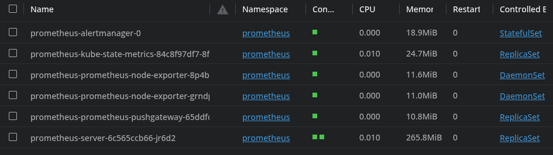

# Answer to Exercise `4.3`

## Query in Prometheus

The query to list the number of pods in the `prometheus` namespace which is controlled by a `StatefulSet` is

```text
sum(kube_pod_info{namespace="prometheus", created_by_kind="StatefulSet"})
```

**The result of which was 1**

## Screenshots

### Result of Query Execution in Prometheus



### Pods and their Controllers (screenshot from Lens)


